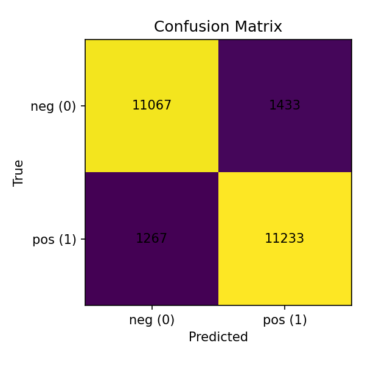

# 🎯 Sentiment Analyser  
*A Machine Learning Project for Text Sentiment Classification*

---

## 📌 Overview
This project is a **sentiment analysis tool** that classifies movie reviews as **positive** or **negative** using a **Linear SVM model** trained on the **IMDB dataset**.  
It uses **TF-IDF vectorization** with character-level n-grams for better performance on noisy text.

Built with **Python** and **scikit-learn**, the model achieves **~89% accuracy** on the IMDB test set.
It also supports **custom training** with your own CSV datasets, provides **explainable predictions**, and includes **visualizations** like confusion matrices to better understand model performance.

### 💡 Motivation:
I built this project to **explore Natural Language Processing (NLP)** and understand how machine learning models can process language, make predictions, and explain their reasoning.
By training on the IMDB dataset, I gained experience with **feature engineering, model training, evaluation, and explainability.**

---

## 🚀 Features
- **Train** the model on IMDB or custom CSV datasets.
- **Predict** sentiment for any input text.
- **Explainability**: Understand which features contribute most to the model’s decisions.
- **Visualizations**: Includes confusion matrix for performance evaluation.

---

## 📂 Project Structure
```
├── README.md
├── metrics
│   └── confusion_matrix.png
├── requirements.txt
├── sample_data
│   └── sample_sentiment.csv
└── src
    ├── explain.py # Displays top positive & negative features
    ├── predict.py # Predict sentiment for custom text
    └── train.py  # Trains the model (IMDB or CSV)
```

---

## 📊 Model Performance (IMDB Dataset)
| Metric          | Score |
|---------------|--------|
| **Accuracy**   | **89.2%** |
| **F1-score**   | 0.892 |
| **Precision**  | 0.892 |
| **Recall**     | 0.892 |



---

## 🛠️ Installation & Setup

### **1️⃣ Clone the Repository**
```bash
git clone https://github.com/adam-2005-99/Sentiment-Analysis.git
cd Sentiment-Analysis  
```
### **2️⃣ Create a Virtual Environment**
```bash
python3 -m venv .venv
source .venv/bin/activate
```
### **3️⃣ Install Dependences**
```bash
pip install -r requirements.txt
```
---

## 📚 Usage
### Train the Model
#### - Train on IMDB:
```bash
python3 src/train.py --dataset imdb
```
#### - Train on a custom CSV Dataset:
```bash
python3 src/train.py --dataset csv --csv_path sample_data/sample_sentiment.csv
```
---
## Make Predictions
### Prediction Sample:
```bash
python3 src/predict.py --text "The movie was absolutely fantastic!"
```
### Expected Output:
**Prediction:** positive (1)  
**Probabilities:** [neg, pos]: [0.12, 0.88]


---
## Explain Model Decisions:
```bash
python3 src/explain.py
```
### Example Output:
```ymal
Top positive features:
amazing, brilliant, beautiful, fantastic...
Top negative features:
awful, boring, waste, terrible...
```
---

## 🧠 Future Enhancements
- Use **deep learning models** like LSTMs or BERT for better accuracy. 
- Deploy as **a web app** using Flask or Streamlit.
- Add **multilingual** sentiment analysis support.

---
## 🧑🏻‍💻 Author
**Name:** Adam Atrash   
**Email:** adam.m.m.atrash@gmail.com

---
## 🏆 Acknowledgments
- IMDB Dataset
- scikit-learn
- Algoverse AI Research — for inspiring this project.

--- 
## 📜 License
This project is licensed under the MIT License — feel free to use and modify.


